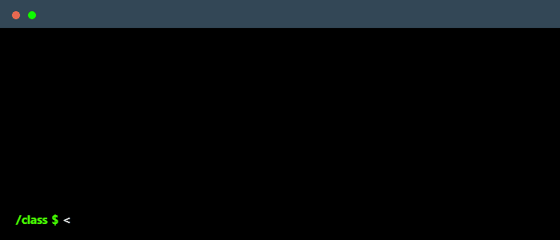

<!-- 
-->

<h1 style="text-align: center;">
  
</h1>

<!--## Hello!   --->

Glad to see you here! I’m a Frontend Developer with deep passion for JavaScript and the Open-Source Community. I balance code with creativity and find peace in a sip of tea🧋.   
Recently, I've been diving into DevOps to streamline workflows and optimize deployments.

- 🚀 Passionate about guiding teams and driving projects to success.
- 🌟 Outside of work, I’m in cinematography and energized by video games.
- 📸 When I'm not coding, find me capturing moments with my camera.
- 💬 Talk to me about if Earth actually is flat, would headlights work at light speed, and everything in between.

 <h2>How I'd define myself...literally 🤓
</h2>
 
 
<h2>⚡What I always play with</h2>

   
    

  
  
    
 
 
    
     
  
  
 

<h2>🧩Familiar With</h2>

   
  
  
  
  
  
   
   
    
  
 
   
    
   
   
 

 
 
 
<!---- Extra Stufff
<h2>📫 Find Me On!</h2>
  .  

  
  
  
  
  

    
    
    
    
    
    
    
    
    
     
    
    
    
    
    
    
    
     
  
  
  
  
  
  
  
  
  

  
  
  
  
  
  
  
  
  
  
  
  
  
  
  
  
  
  
  
  
  
  
  
  
  
  
  
  ----->
 

 <h3 >📊GitHub Stats</h3>

 

<table>
  <tr>
    <td>
     
    </td>
    <td>
      
    </td>
  </tr>
</table>
 

<table>
  <tr>
    <td>
     
    </td>
    <td>
      
    </td>
  </tr>
</table>

  <h2>📫 Find Me On!</h2>

Let's code, connect, and create awesome things together!
 

<table>
  <tr>
    <td colspan="3" align="center">
      
    </td>
    <td align="center">
      
    </td>
    <td align="center">
      
    </td>
    <td align="center">
      
    </td>
    <td align="center">
     
    </td>
      </tr>
</table>

  
<h3>

  
⭐️ [DiprajGirase](https://github.com/diprajgirase) | Let's innovate together! 🚀

</h3>

<!---   Text Stack Stuff Icons 
    <td align="center">
      
    </td>
    <td align="center">
      
    </td>
    <td align="center">
      
    </td>
  </tr>
  <tr>
    <td align="center">
      
    </td>
      <td align="center">
      
    </td>   
    <td align="center">
      
    </td>
    ---->

<!--- 

<h2 >🛠️ Tech Stack</h2>

<h3 >Web Development</h3>

<table style="background-color: black; color: white; border: none; border-radius: 15px; overflow: hidden;">
  <thead>
    <tr>
      <th colspan="8" align="left" style="color: white;">Frontend</th>
    </tr>
  </thead>
  <tbody>
    <tr>
      <td align="center" style="border: none;">
        
         JavaScript
      </td>
       <td align="center" style="border: none;">
        
         React
           </td>
         <td align="center" style="border: none;">
        
         Angular
      </td>
      <td align="center" style="border: none;">
        
         TypeScript
      </td>
       </td>
       <td align="center" style="border: none;">
        
         Next.js
      </td>
      <td align="center" style="border: none;">
        
         Tailwind CSS
      </td>
      <td align="center" style="border: none;">
        
         HTML
      </td>
      <td align="center" style="border: none;">
        
         CSS
      </td>
    </tr>
  </tbody>
</table>

<table style="background-color: black; color: white; border: none; border-radius: 15px; overflow: hidden;">
  <thead>
    <tr>
      <th colspan="4"  align="left" style="color: white;">Database</th>
    </tr>
  </thead>
  <tbody>
    <tr>
      <td align="center" style="border: none;">
         MySQL
      </td>
      <td align="center" style="border: none;">
         MongoDB
      </td>
      <td align="center" style="border: none;">
         PostgreSQL
      </td>
<!--       <td align="center" style="border: none;">
         Neo4j
      </td>
    </tr> 
  </tbody>
</table>

<h3 > AI Tools & Prompt Engineering</h3>

 <table style="background-color: black; color: white; border: none; border-radius: 15px; overflow: hidden;">
  <thead>
    <tr>
      <th colspan="6"  align="left" style="color: white;">AI Tools</th>
    </tr>
  </thead>
  <tbody>
    <tr>
      <td align="center" style="border: none;">
         ChatGPT
      </td>
        <td align="center" style="border: none;">
         Claude (Anthropic)
      </td>  
      <td align="center" style="border: none;">
         Google Gemini
      </td>
       <td align="center" style="border: none;">
         Hugging Face
      </td>  
      <td align="center" style="border: none;">
         Meta Llama
      </td>
     <td align="center" style="border: none;">
         Cohere
      </td> 
    </tr>  </tbody></table>

--->

<!---

-👋 Hi, I’m @diprajgirase
- 👀 I’m interested in ...
- 🌱 I’m currently learning ...
- 💞️ I’m looking to collaborate on ...
- 📫 How to reach me ...
- 😄 Pronouns: ...
- ⚡ Fun fact: ...

dipraj is a ✨ special ✨ repository because its `README.md` (this file) appears on your GitHub profile.
You can click the Preview link to take a look at your changes.
--->
